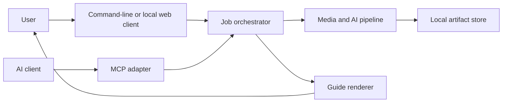
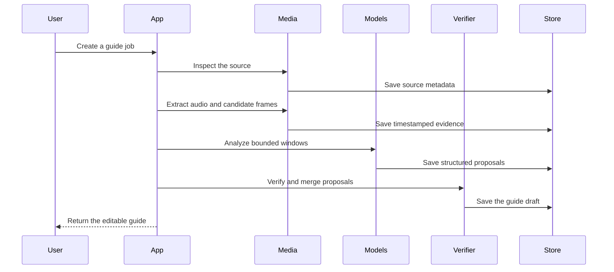

# System Architecture

## 1. Architecture goal

The architecture separates media analysis, AI inference, guide assembly, and client integration.
This separation keeps the engine testable and replaceable.

## 2. System context

## 3. Main components

### 3.1 Client adapters

Client adapters translate client requests into application commands.
They do not contain media or model logic.

Planned adapters include:

- Command-line interface
- Local web interface
- Model Context Protocol server
- Local HTTP application programming interface

### 3.2 Application service

The application service controls jobs.
It validates requests and applies resource limits.
It records job state and audit data.

### 3.3 Media service

The media service uses FFmpeg.
It inspects files and extracts audio, frames, and clips.

### 3.4 Evidence service

The evidence service makes timestamped records.
Records can contain speech, visible text, frames, or motion.

### 3.5 Model adapters

A model adapter has one stable internal interface.
It hides runtime-specific prompts and response formats.

Initial adapters will include:

- `whisper.cpp` for speech on Apple Silicon
- `faster-whisper` for compatible Linux systems
- MLX-VLM with Qwen3-VL for visual analysis
- PaddleOCR for visible text

### 3.6 Step assembler

The step assembler merges related proposals.
It removes duplicates and keeps evidence links.

### 3.7 Step verifier

The verifier tests each instruction against its evidence.
It calculates confidence features and sets the review state.

### 3.8 Artifact store

The artifact store uses the local file system in version 0.1.
It uses content digests and a job manifest.

The store contains:

- Source metadata
- Extracted audio
- Candidate frames
- Optical character recognition results
- Model responses
- Guide versions
- Export files

### 3.9 Renderer

The renderer reads only the public guide contract.
It writes Markdown, HTML, JSON, and image assets.

## 4. Processing sequence

## 5. Job states

A job can have these states:

1. `queued`
2. `inspecting`
3. `extracting`
4. `analyzing`
5. `verifying`
6. `ready_for_review`
7. `exporting`
8. `complete`
9. `failed`
10. `canceled`

Each transition must be idempotent.
A retry must not duplicate a completed artifact.

## 6. Contract rules

The public guide schema is in `schemas/guide.schema.json`.
The project will version all public contracts.

A breaking change requires:

- A new major schema version
- A migration function
- Compatibility tests
- An architecture decision record

## 7. Deployment profiles

### 7.1 Personal local profile

All services run on one computer.
This profile is the version 0.1 release target.

### 7.2 Local network profile

The engine runs on a private workstation.
Other trusted devices use an authenticated local endpoint.

### 7.3 Remote integration profile

A private worker processes media.
A public gateway exposes selected MCP tools.
The gateway does not expose source files without authorization.

This profile is necessary for public ChatGPT plugin distribution.
It is not part of version 0.1.

## 8. Decision boundaries

The project will not put these concerns in the core engine:

- Client authentication
- Platform-specific user interface metadata
- Cloud billing
- Proprietary model requests
- Video download functions

Architecture decision records define the current major decisions.
